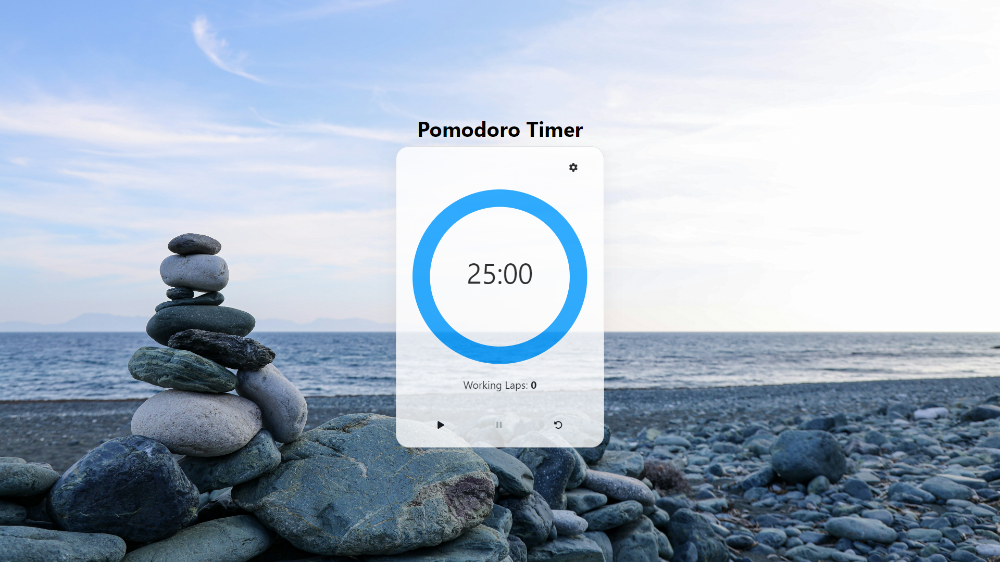

# Pomodoro Timer

## Overview

The Pomodoro Timer is a productivity tool designed to help you manage your time effectively. It uses the Pomodoro Technique, which involves working in intervals (typically 25 minutes) followed by short breaks. Customize work and rest intervals to optimize focus and productivity.

## Features

- **Customizable Intervals**: Set your preferred work and rest times.
- **Timer Visualization**: See the progress with a circular timer.
- **Audio Alerts**: Receive sound notifications when intervals change.
- **Responsive Design**: Works on various devices including desktop and mobile.